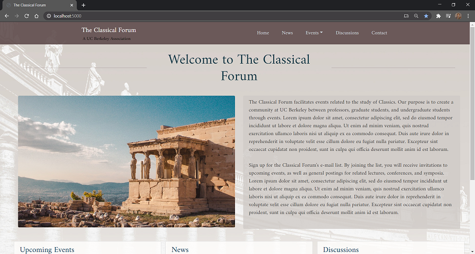
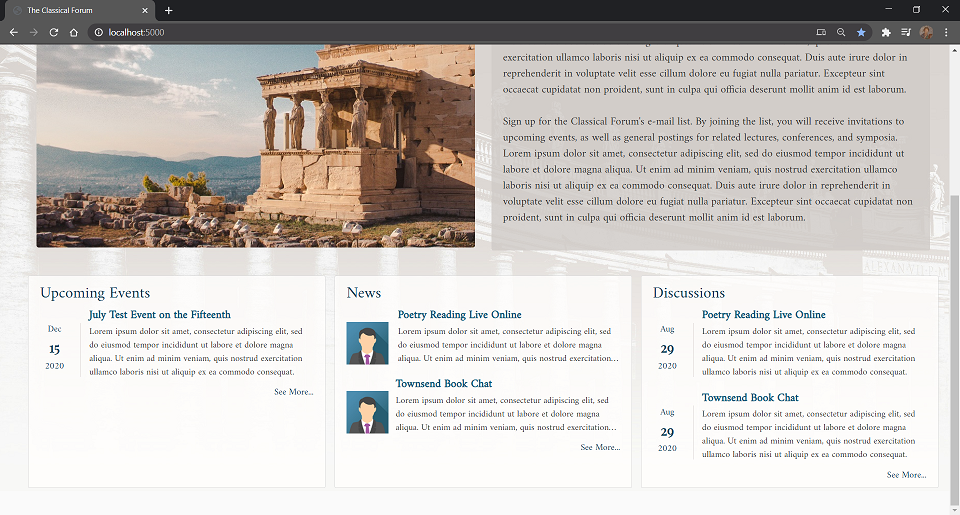
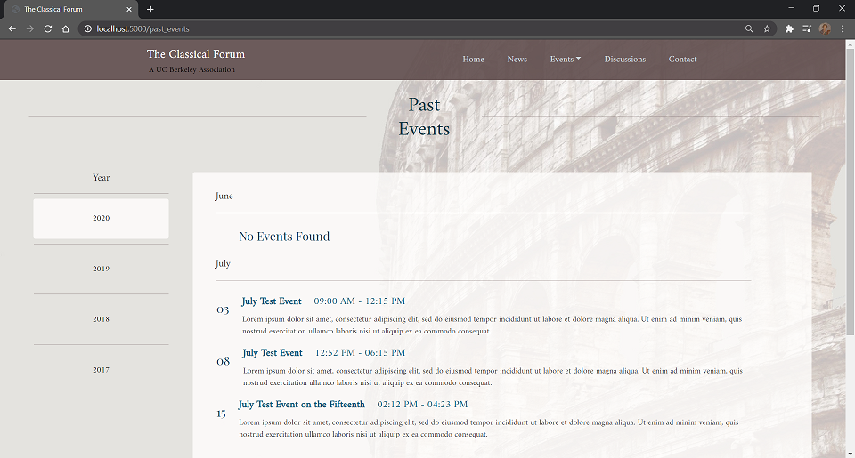

This website displays events, news, discussions, and contact information. Events and news are not hard-coded but stored in a SQLite database for easy modificaiton. Web architecture is Flask. Bootstrap is used for HTML styling. As of Aug. 2020 this project is on hold.

Remember to use CTRL-F5 to update without browser cache
-- Will not update CSS otherwise

